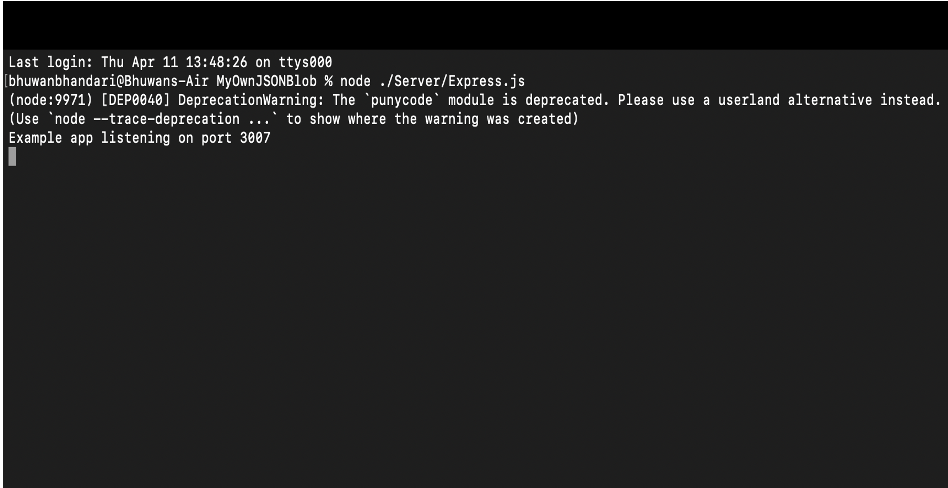
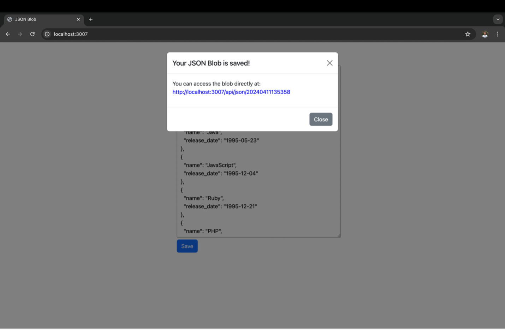
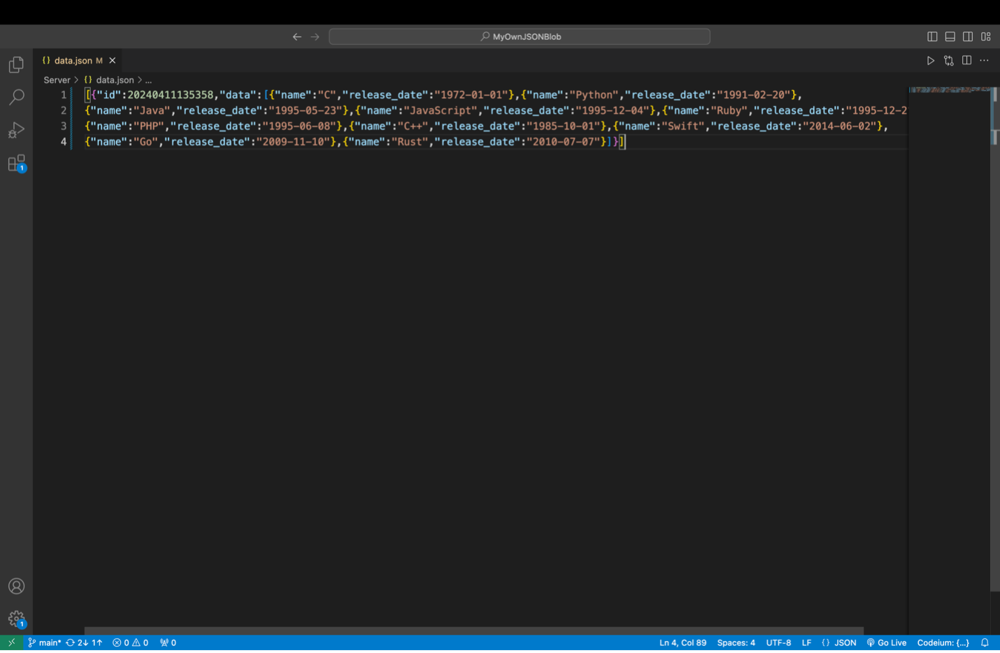
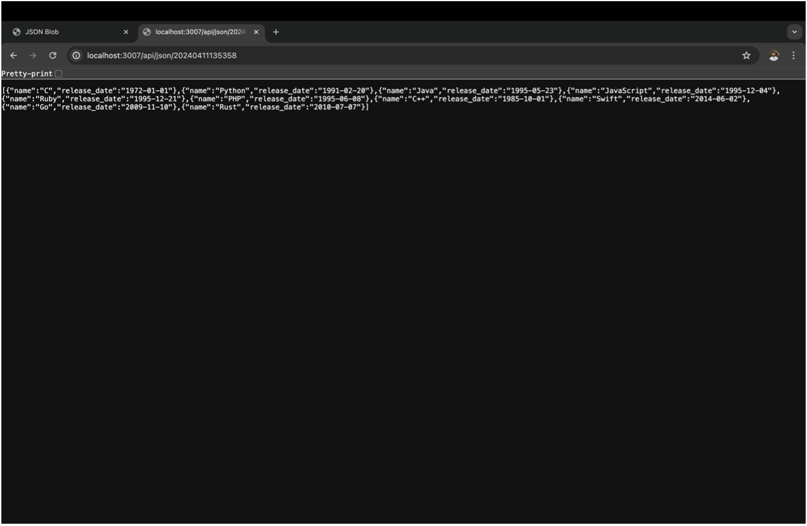
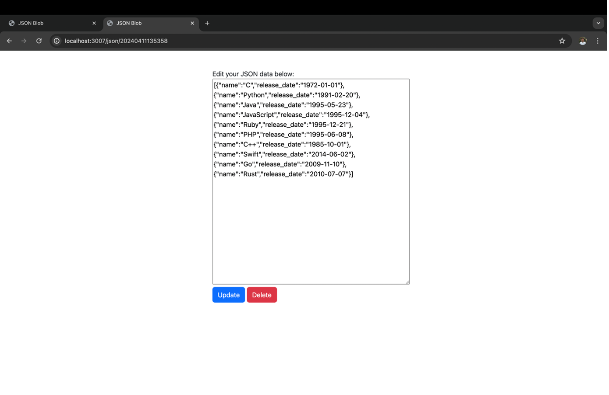

# JSON Blob Website

## Overview

Welcome to my personal JSON Blob Website that works similarly as the well known JSON Blob website. This platform allows users to create, store, retrieve, update, and delete JSON data through a simple API. Each piece of JSON data is assigned a unique identifier, which serves as the link to access and manipulate it.

### Getting Started

To get started with the JSON Blob Website, follow these steps:

- Visit the Website: Navigate to the JSON Blob Website using the provided URL. Please use localhost/${portnumber}. Port number can be user defined.  

- Create JSON Data: Click on the "Create" button to generate a new JSON blob. This will assign a unique identifier to your data.

- Modify Data: Use the provided editor to modify the JSON data as per your requirements.
- Save Data: Once you're satisfied with the changes, click on the "Save" button to store the data.

- Access Data: You can access your JSON data anytime by using the unique identifier provided after saving and also update it.

### API Usage
- The JSON Blob Website provides a simple API to interact with the stored data. Here are the available endpoints:
- GET /api/{identifier}: Retrieve the JSON data associated with the provided identifier.
- POST /api: Create a new JSON blob with the provided data. This handles the create property. 
- DELETE /api/{identifier}: Delete the JSON data associated with the provided identifier.
